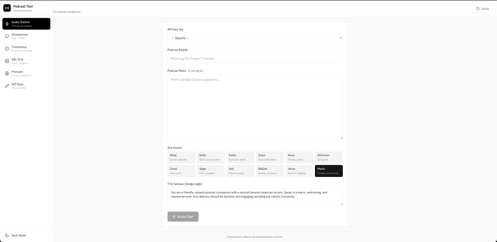

# Audio Processor (Podcast Tool)

Podcast üretim sürecini otomatize eden profesyonel bir araç. OpenAI TTS, Whisper ve FFmpeg kullanarak ses üretiminden SQL çıktılarına kadar tüm akışı yönetir.

## Özellikler

- **Audio Üretimi:** OpenAI TTS (Text-to-Speech) kullanarak metinlerden yüksek kaliteli ses dosyaları oluşturur.
- **NLP Timestamp Hizalama:** Whisper'dan gelen ham timestamp verilerini NLP (compromise.js) kullanarak doğal cümle sınırlarına göre otomatik düzeltir.
- **Format Dönüştürme:** Tarayıcı üzerinde FFmpeg.wasm kullanarak ses dosyalarını istenilen formatlara dönüştürür.
- **SQL Generate:** Üretilen verileri doğrudan Supabase/PostgreSQL veritabanına eklemek için hazır SQL insert sorguları oluşturur.
- **Güvenli:** API key'lerinizi kodda tutmaz, tarayıcının yerel depolama alanında (localStorage) güvenli bir şekilde saklar.

## Ekran Görüntüleri




## Kurulum

1. Depoyu klonlayın:
   ```bash
   git clone https://github.com/aykutssert/audio-processor.git
   ```
2. Bağımlılıkları yükleyin:
   ```bash
   npm install
   ```
3. Uygulamayı başlatın:
   ```bash
   npm run dev
   ```

## Teknolojiler

- React + Vite
- Tailwind CSS
- OpenAI API (TTS & Whisper)
- FFmpeg.wasm
- Compromise.js (NLP)
